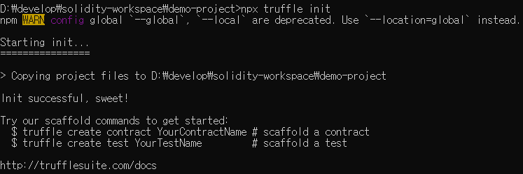
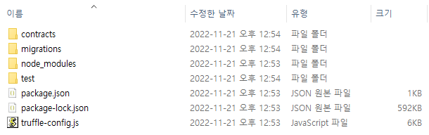

### 프로젝트 생성
```bash 
mkdir demo-project
```
```bash
cd demo-project
```

### Truffle 설치
```bash
npm install truffle
```

### Truffle 버전 확인
```bash
npx truffle version
```

### 프로젝트 초기화
```bash
npx truffle init
```
---




### 생성된 파일 설명
#### Contracts
작성한 `Smart Contract`가 저장되는 폴더

#### migrations
`Smart Contract`를 자체 블록체인 서버 또는 `Ganache`에 배포하기 위한 폴더

#### test
작성한 Smart Contract 테스트를 위한 폴더

#### truffle-config.js
Truffle 에 대한 설정 파일

#### 빌드 
```bash
npx truffle compile
```
빌드 완료 시 build/contracts 에 json 파일 생성


