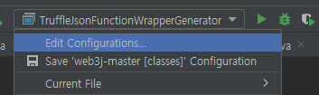

# web3j Repository 소스 다운

|  | URL                            |
| ------ |--------------------------------|
| GitHub | https://github.com/web3j/web3j |

## Edit Configurations 창 열기

## Application 설정
이미지와 같이 설정

main 클래스 `org.web3j.codegen.TruffleJsonFunctionWrapperGenerator`

### 옵션 설명
`기본인자` Truffle로 빌드된 `Smart Contract` 의 json 파일 경로

`-o` Web3j 결과물이 생성될 위치

`-p` 생성되는 결과물의 패키지명

### 변환하기

